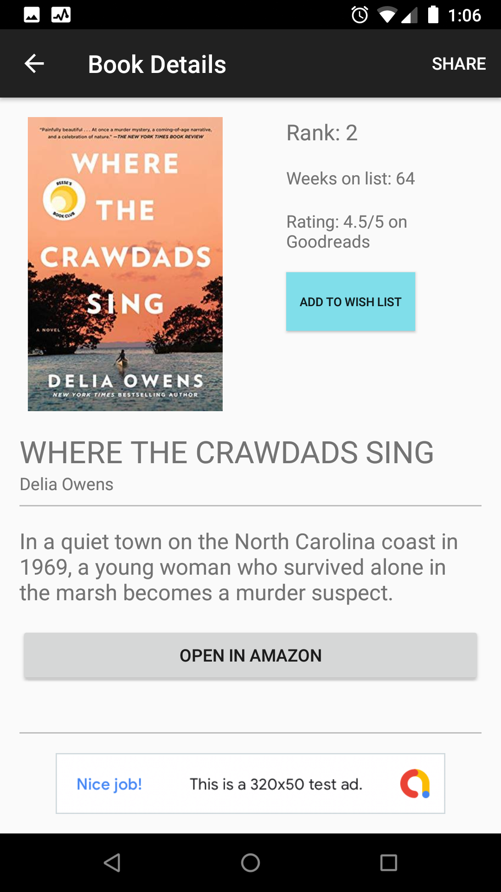

# BestReads
## Description
An Android app that helps you discover The New York Times bestseller books, sorted by category. You can also save a wish list.

## Intended User
Book Readers

## Features
* Displays a grid arrangement of book covers upon launch.

* Allows the user to change category via a setting.

* Allows the user to tap on a book cover, and transition to a details screen.

* Allows the user to view the book on amazon.

* Allows the user to add a book to their wish list, and saves it for future reference.

## Usage
##### API Key Note
Create a file named apikey.properties in your root directory.

Add your api keys to that file.

NYTIMES_API_KEY="YOUR-NYTIMES-API-KEY"

GOODREADS_API_KEY="YOUR-GOODREADS-API-KEY"

Reference: [Storing Secret Keys in Android](https://guides.codepath.com/android/Storing-Secret-Keys-in-Android#hidden-in-buildconfigs)

## Technology Used
* Java 8
* Android 10 (API 29)
* Gradle 5.4.1
* Retrofit 2.6.2
* Picasso 2.71828
* Room 2.2.0
* Google Mobile Ads 18.2.0
* Google Analytics 17.0.0

## Screenshots

Main Screen

Main Screen (Landscape)

Detail Screen

Detail Screen (Landscape)

App Widget

## Summary
* Used Retrofit for connecting with the nytimes server.
* Used Android Architecture Components (Room, LiveData, & ViewModel) to create & save wish list data in the database.
* Built a home screen app widget.
* Used Shared Preferences for data persistence.
* Used AsyncTask for connecting with the goodreads server on a background thread.
* Used Google AdMob to display test ads.
* Used Firebase Analytics.
* Created a separate landscape layout (adaptive design).
* Implemented share functionality, using implicit intent and extras, to share a book's information.
